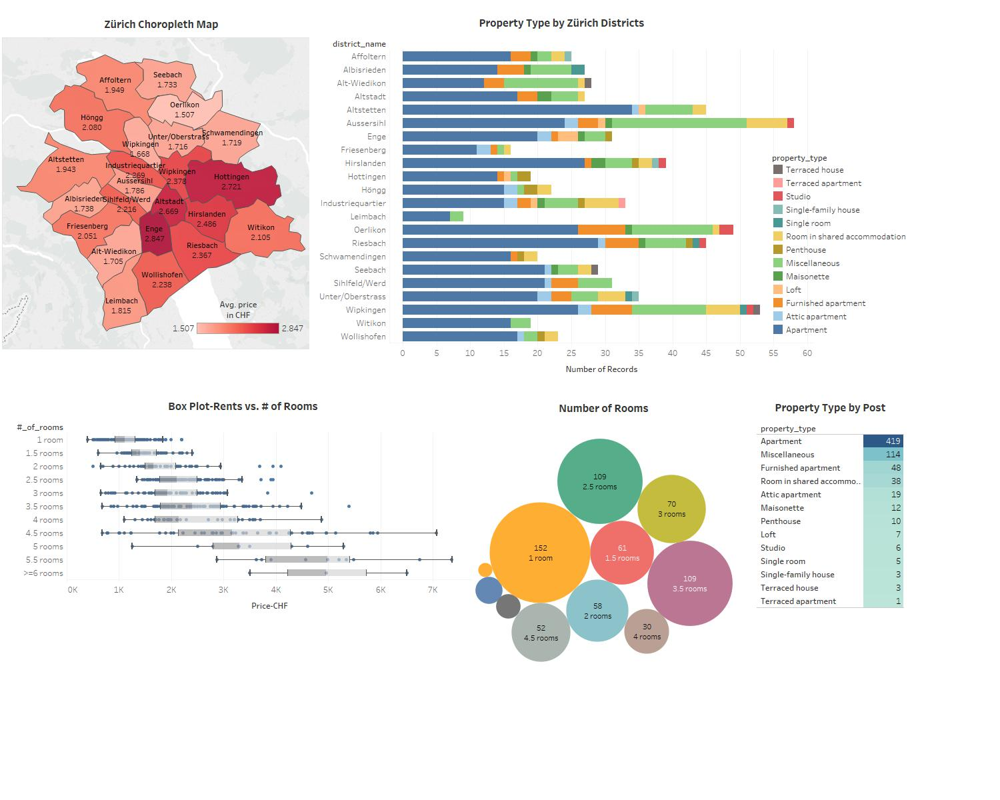

# Web Scraping Project-Zurich Real Estate Market
Web scraping project to analyze current rental real estate market of Zürich.

Purpose of this project to conduct web scraping process codes to scrap one of the biggest real estate website of Switzerland, comparis.ch, to generate deeper insights about Zürich Rental Real Estate Market. 

Project initiates with python code to connect the website, iterate over relevant 100 pages, gather data and write over csv file. Later on, design python code conducts data cleansing and processing steps to prepare data for visualization purposes. Then, clean data is processed within one of the top visualization software, Tableau, to generate insight dashboard. Clean data is also mapped into geospatial domain to provide deeper understanding about districts of Zurich.Final dashboard reflects insights about 685 rent post of the website within the scope of Zürich location by January 2019.

Do not hesitate to contact for questions and feedbacks.

